  <picture><source media="(prefers-color-scheme: light)" srcset="assets/light/topbar.svg"></picture>
  <a href="https://www.linkedin.com/in/leopoldpichonneau"><picture><source media="(prefers-color-scheme: light)" srcset="assets/light/btn-linkedin.svg"></picture></a>

  <picture><source media="(prefers-color-scheme: light)" srcset="assets/light/header.svg"></picture>

<h4 align="center">
  I write code. 
  Sometimes it works.
</h4>

  <picture><source media="(prefers-color-scheme: light)" srcset="assets/light/terminal.svg"></picture>

  <picture><source media="(prefers-color-scheme: light)" srcset="assets/light/cto.svg"></picture>

<h3 align="center">Projects</h3>

  <a href="https://github.com/LeopoldPichonneau/IntelliWood"><picture><source media="(prefers-color-scheme: light)" srcset="assets/light/project-intelliwood.svg"></picture></a>&nbsp;&nbsp;&nbsp;&nbsp;&nbsp;
  <a href="https://github.com/LeopoldPichonneau/Online-Bookstore"><picture><source media="(prefers-color-scheme: light)" srcset="assets/light/project-online-bookstore.svg"></picture></a>

<h3 align="center">Tech Stack</h3>

  <picture><source media="(prefers-color-scheme: light)" srcset="assets/light/stack.svg"></picture>

  <picture><source media="(prefers-color-scheme: light)" srcset="assets/light/footer.svg"></picture>

  

